# Multi-Tenant SaaS + IAM + ABAC platform Hierarchy

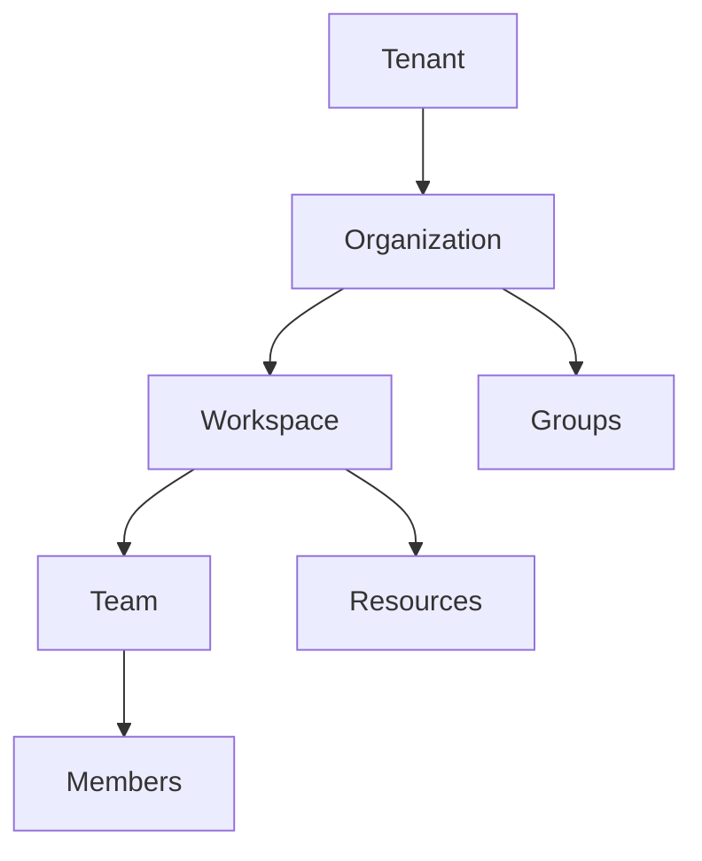

## Monetization & Entitlements Flow

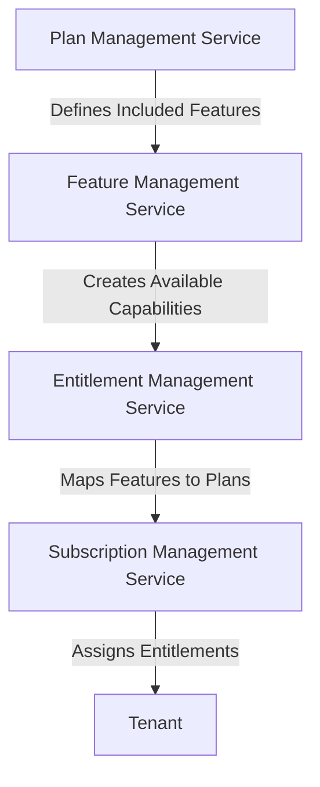

## Access Governance & Approval Flow

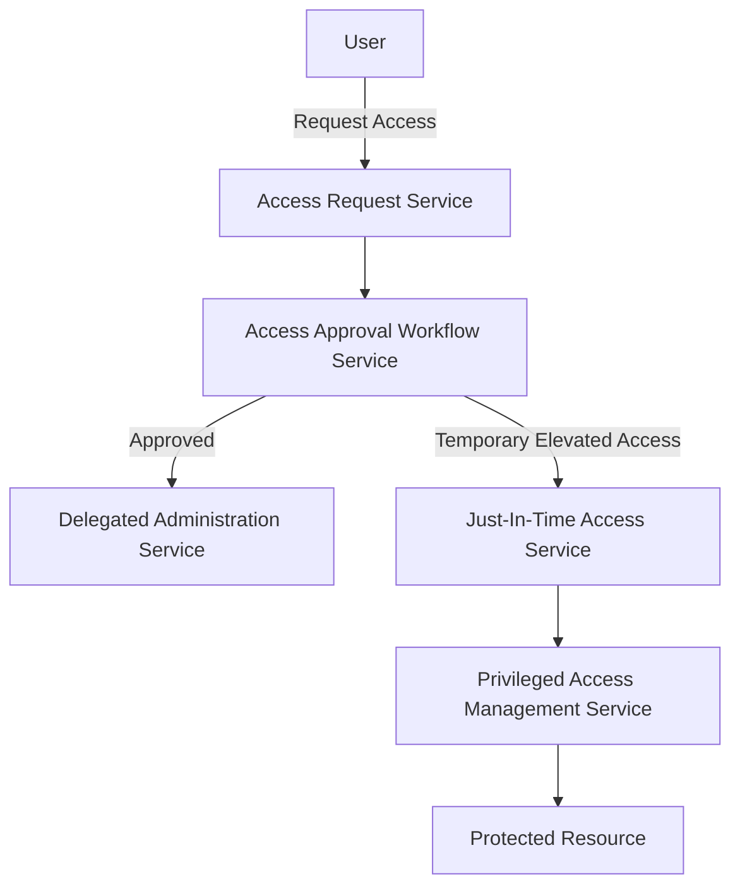

## Access Review & Compliance Flow

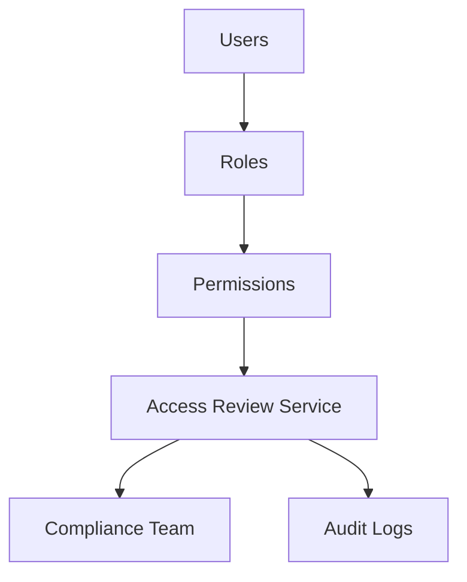

## Complete IAM Governance Architecture

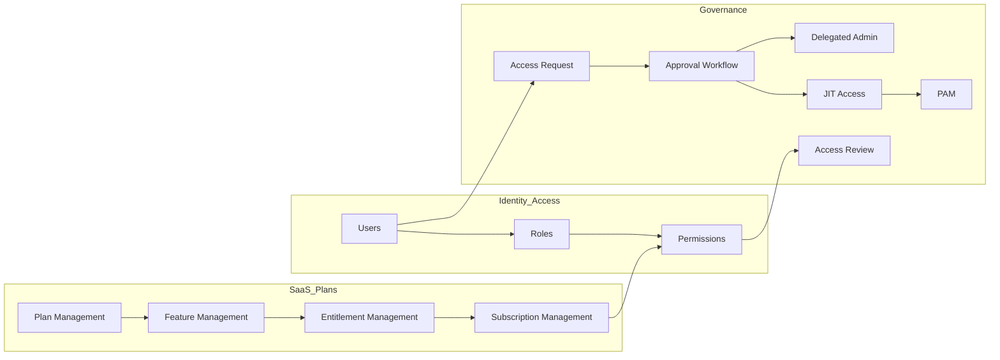

## Enterprise ABAC + IAM Architecture

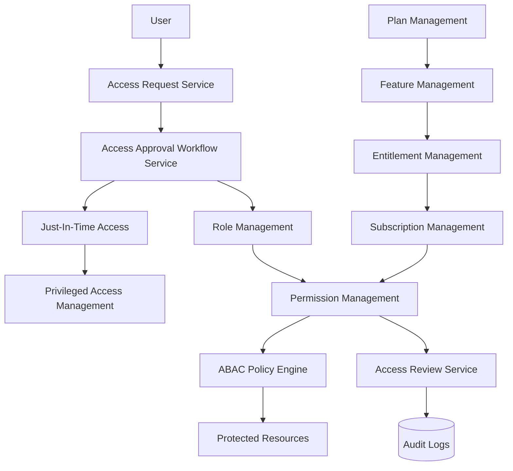

## Relationship

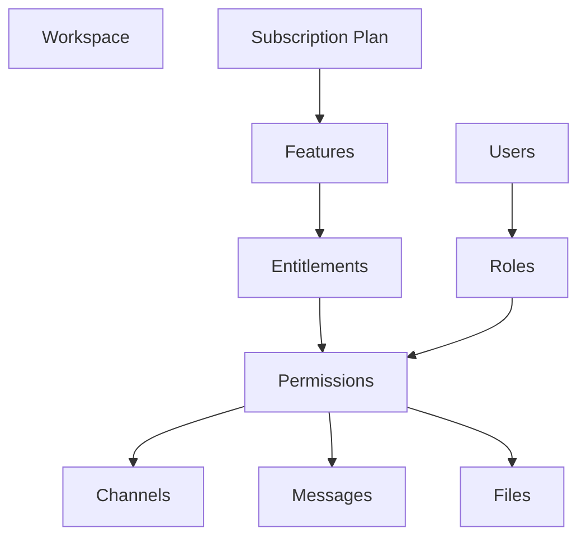

## Access Flow

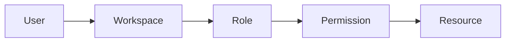
## Enterprise Grid Architecture

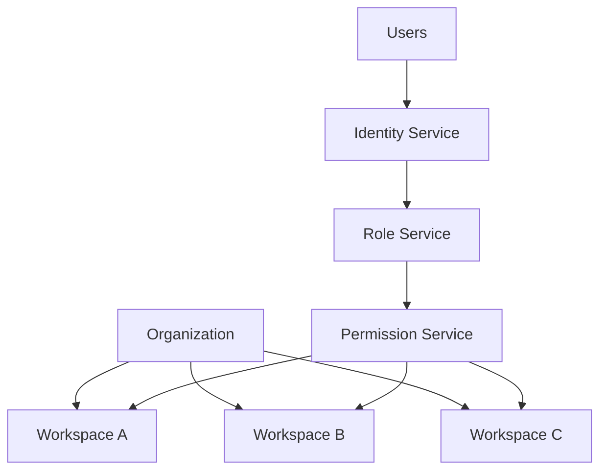
## Monetization Flow

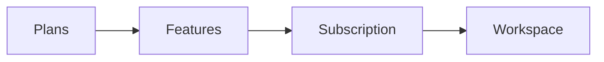
## IAM + ABAC Architecture

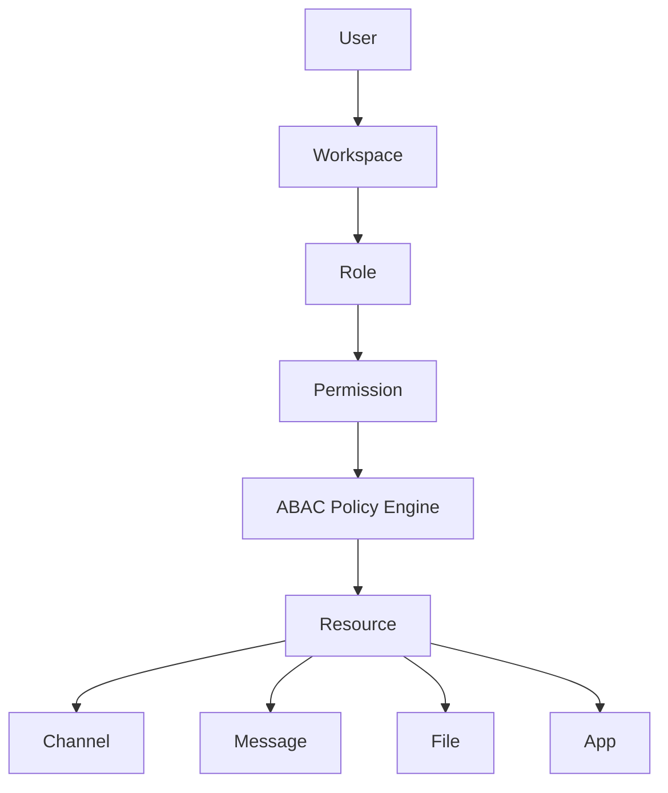