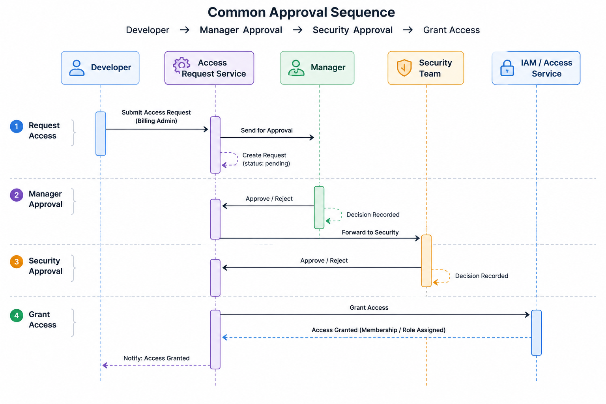

# Access Approval Workflow Service

## Purpose

The Access Approval Workflow service manages the approval process required before requested access can be granted.

It coordinates approval stages, tracks decisions, and ensures that access follows organizational policies and governance rules.

## Example

A common approval sequence may look like:

```text id="x2p715"
Developer
    ↓
Manager Approval
    ↓
Security Approval
    ↓
Grant Access
```



## Responsibilities

The Access Approval Workflow service handles:

* Approval chains
* Multi-level approvals
* Escalation workflows
* SLA tracking
* Approval status management
* Decision auditing

## Approval Workflow Process

```text id="w8f420"
Access Request
        ↓
Assign Approval Chain
        ↓
Review Request
        ↓
Approve / Reject
        ↓
Escalate if Needed
        ↓
Grant Access
```

## Ownership Model

An approval workflow owns and manages the following attributes:

```text id="m6r913"
Approval Workflow
├── Request
├── Approval Steps
├── Approvers
├── Status
├── SLA
└── Escalation Rules
```

## Example Structure

Example approval workflow object:

```json id="z4n601"
{
  "request_id": "request_123",
  "status": "in_progress",
  "steps": [
    {
      "level": 1,
      "approver": "manager_456",
      "status": "approved"
    },
    {
      "level": 2,
      "approver": "security_789",
      "status": "pending"
    }
  ]
}
```

## API Endpoints

### Workflow Management

```http id="f9x203"
POST   /approval-workflows
GET    /approval-workflows
GET    /approval-workflows/{id}
```

### Approval Actions

```http id="j3v825"
POST   /approvals/{id}/approve
POST   /approvals/{id}/reject
POST   /approvals/{id}/escalate
```

### Approval Queries

```http id="k5d710"
GET    /approvals/pending
```

## Approval Workflow Relationships

```text id="u7t532"
Approval Workflow
├── Access Request
├── Approval Steps
│   ├── Manager Approval
│   ├── Security Approval
│   └── Additional Approvals
├── Escalation Rules
├── SLA Tracking
└── Final Decision
```
