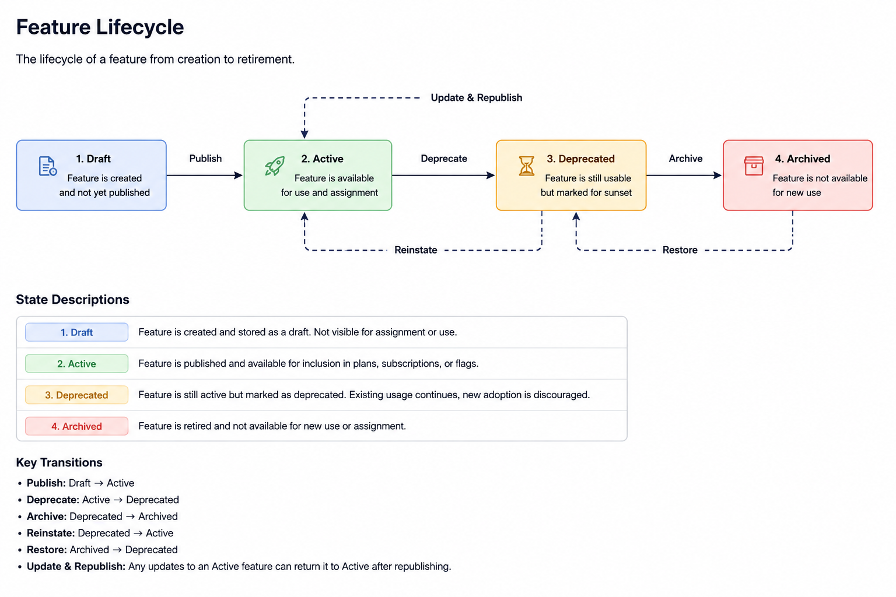

# Feature Management Service

## Purpose

The Feature Management service maintains the catalog of product capabilities available within the platform.

This service defines and organizes features that can later be associated with plans, subscriptions, entitlements, or feature-flag systems.

The service does **not** manage customer subscriptions or access decisions.

Its responsibility is limited to feature definitions and metadata management.


## Examples

Common platform features may include:

```text id="x8v342"
AI Assistant
Custom Domains
Advanced Reports
SSO
```

## Responsibilities

The Feature Management service handles:

* Create features
* Organize features
* Manage feature metadata
* Manage feature ownership
* Maintain feature catalog definitions

## Feature Lifecycle

```text id="r5m810"
Create Feature
        ↓
Configure Metadata
        ↓
Assign Ownership
        ↓
Organize Feature Catalog
        ↓
Publish Feature
        ↓
Archive Feature
```

## Ownership Model

A feature owns and manages the following attributes:

```text id="j9n235"
Feature
├── Name
├── Description
├── Category
├── Owner
├── Metadata
└── Status
```

## Example Structure

Example feature object:

```json id="p3t906"
{
  "id": "feature_ai_assistant",
  "name": "AI Assistant",
  "description": "AI-powered assistant capability",
  "category": "productivity",
  "owner": "platform_team",
  "metadata": {
    "tier": "Professional"
  },
  "status": "active"
}
```

## API Endpoints

### Feature Management

```http id="z7k518"
POST   /features
GET    /features
GET    /features/{id}
PATCH  /features/{id}
DELETE /features/{id}
```

## Feature Relationships

```text id="n4q627"
Feature
├── Metadata
├── Category
├── Ownership
├── Status
└── Consumers
    ├── Plans
    ├── Subscriptions
    └── Feature Flags
```
