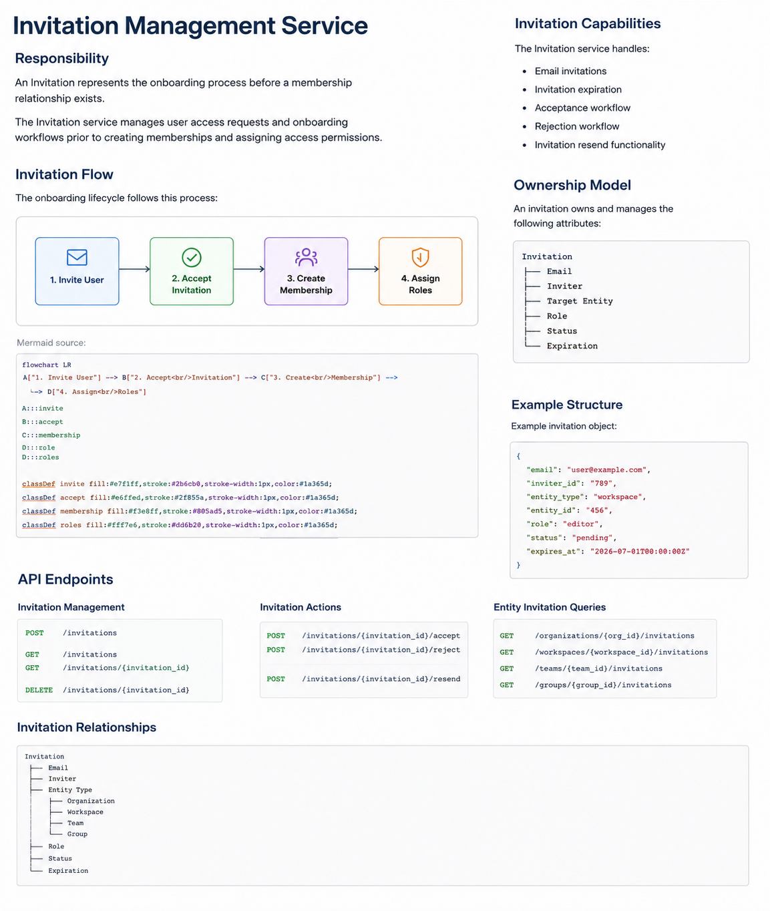

# Invitation Management Service

## Responsibility

An Invitation represents the onboarding process before a membership relationship exists.

The Invitation service manages user access requests and onboarding workflows prior to creating memberships and assigning access permissions.

## Invitation Flow

The onboarding lifecycle follows this process:

```text id="k2x847"
Invite User
      ↓
Accept Invitation
      ↓
Create Membership
      ↓
Assign Roles
```



## Invitation Capabilities

The Invitation service handles:

* Email invitations
* Invitation expiration
* Acceptance workflow
* Rejection workflow
* Invitation resend functionality

## Ownership Model

An invitation owns and manages the following attributes:

```text id="h4p620"
Invitation
├── Email
├── Inviter
├── Target Entity
├── Role
├── Status
└── Expiration
```

## Example Structure

Example invitation object:

```json id="s9m342"
{
  "email": "user@example.com",
  "inviter_id": "789",
  "entity_type": "workspace",
  "entity_id": "456",
  "role": "editor",
  "status": "pending",
  "expires_at": "2026-07-01T00:00:00Z"
}
```

## API Endpoints

### Invitation Management

```http id="w7t913"
POST   /invitations

GET    /invitations
GET    /invitations/{invitation_id}

DELETE /invitations/{invitation_id}
```

### Invitation Actions

```http id="n5f108"
POST   /invitations/{invitation_id}/accept
POST   /invitations/{invitation_id}/reject

POST   /invitations/{invitation_id}/resend
```

### Entity Invitation Queries

```http id="y8r621"
GET    /organizations/{org_id}/invitations
GET    /workspaces/{workspace_id}/invitations
GET    /teams/{team_id}/invitations
GET    /groups/{group_id}/invitations
```

## Invitation Relationships

```text id="e1z493"
Invitation
├── Email
├── Inviter
├── Entity Type
│   ├── Organization
│   ├── Workspace
│   ├── Team
│   └── Group
├── Role
├── Status
└── Expiration
```
