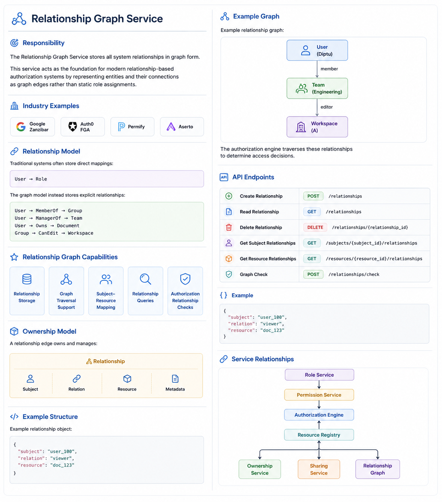

# Relationship Graph Service

## Responsibility

The Relationship Graph Service stores all system relationships in graph form.

This service acts as the foundation for modern relationship-based authorization systems by representing entities and their connections as graph edges rather than static role assignments.

## Industry Examples

Graph-based authorization systems commonly use this model:

```text id="w6x104"
Google Zanzibar
Auth0 FGA
Permify
Aserto
```

## Relationship Model

Traditional systems often store direct mappings:

```text id="u2d631"
User → Role
```

The graph model instead stores explicit relationships:

```text id="r8k502"
User → MemberOf → Group

User → ManagerOf → Team

User → Owns → Document

Group → CanEdit → Workspace
```

## Relationship Graph Capabilities

The Relationship Graph Service provides:

* Relationship storage
* Graph traversal support
* Subject-resource mapping
* Relationship queries
* Authorization relationship checks

## Ownership Model

A relationship edge owns and manages:

```text id="g4f209"
Relationship
├── Subject
├── Relation
├── Resource
└── Metadata
```

## Example Graph

Example relationship graph:

```text id="m9r480"
User(Diptu)
      |
      | member
      v
Team(Engineering)
      |
      | editor
      v
Workspace(A)
```

The authorization engine traverses these relationships to determine access decisions.

## Example Structure

Example relationship object:

```json id="p5n726"
{
  "subject": "user_100",
  "relation": "viewer",
  "resource": "doc_123"
}
```

## API Endpoints

### Relationship Management

```http id="x1v534"
POST   /relationships
GET    /relationships
DELETE /relationships/{relationship_id}
```

### Relationship Queries

```http id="f3j812"
GET    /subjects/{subject_id}/relationships

GET    /resources/{resource_id}/relationships
```

### Authorization Checks

```http id="d7z264"
POST   /relationships/check
```

## Service Relationships

```text id="q8y193"
Role Service
      │
      ▼
Permission Service
      │
      ▼
Authorization Engine
      ▲
      │
Resource Registry
      │
      ├─────────────► Ownership Service
      │
      ├─────────────► Sharing Service
      │
      └─────────────► Relationship Graph
```


## Graph Relationships

```text id="c5t847"
Subject
    │
    ▼
Relationship
    │
    ▼
Resource
```

Examples:

* User → MemberOf → Group
* User → OwnerOf → Document
* User → EditorOf → Workspace
* Team → CanManage → Project

## Important Notes

The Relationship Graph Service does not directly make authorization decisions.

Its responsibility is to:

* Store relationships
* Provide graph traversal data
* Support relationship checks
* Supply relationship context to authorization engines

Authorization logic itself is performed by higher-level services and policy engines.
