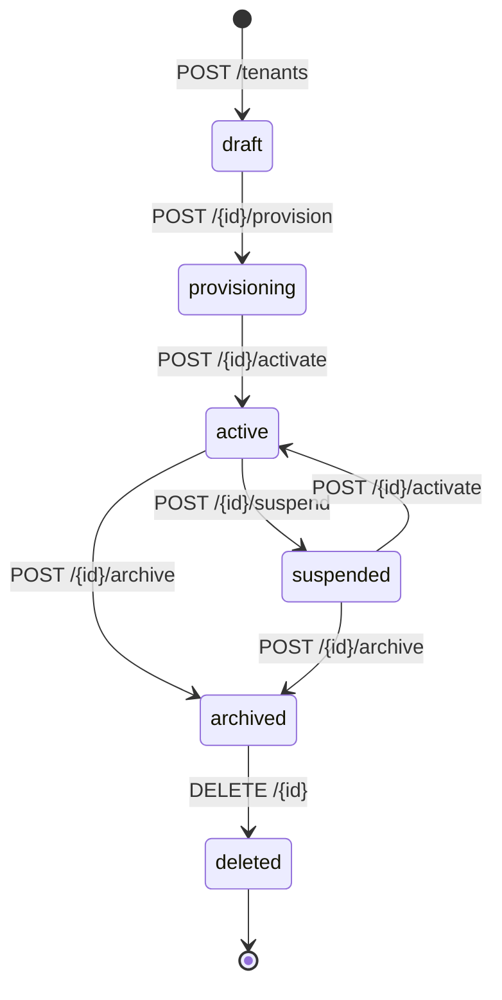

# Tenant Lifecycle

Every tenant moves through a defined set of states. This page describes the state machine, valid transitions, and the rules that govern each transition.

---

## State Diagram

---

## States

| State | Description | Billable |
|---|---|---|
| `draft` | Tenant record created; no infrastructure allocated. Entry state. | No |
| `provisioning` | Async infrastructure setup in progress (database, API keys, networking). | No |
| `active` | Fully operational. All APIs accessible. | Yes |
| `suspended` | Service paused — non-payment or policy violation. All user logins and API access blocked. Data retained. | No |
| `archived` | Read-only cold storage. All write operations return `423 Locked`. Prerequisite for deletion. | No |
| `deleted` | Soft-deleted. Record is retained for audit and compliance. Hard purge is performed by the Tenant Offboarding Service after the retention period expires. | No |

---

## Transition Rules

| Endpoint | Source State(s) | Target State | Notes |
|---|---|---|---|
| `POST /{id}/provision` | `draft` | `provisioning` | Starts infrastructure provisioning. |
| `POST /{id}/activate` | `provisioning` | `active` | Called when provisioning is complete. |
| `POST /{id}/activate` | `suspended` | `active` | Reactivates a suspended tenant. |
| `POST /{id}/suspend` | `active` | `suspended` | Blocks all access; data preserved. |
| `POST /{id}/archive` | `active`, `suspended` | `archived` | Locks tenant; prerequisite for deletion. |
| `DELETE /{id}` | `archived` | `deleted` | Soft-delete. Name slug remains reserved. |

All transitions except `DELETE` accept an optional `{ "reason": "..." }` body for audit clarity.

A `409 Conflict` is returned if the source state is not valid for the requested transition.

---

## Domain Events

Every state-changing operation emits a domain event. Events are currently logged and will be published to the `tenant.events` RabbitMQ exchange in production.

| Event | Trigger |
|---|---|
| `TenantCreated` | `POST /tenants` |
| `TenantUpdated` | `PATCH /tenants/{id}` |
| `TenantProvisioningStarted` | `POST /{id}/provision` |
| `TenantActivated` | `POST /{id}/activate` (from `provisioning`) |
| `TenantReactivated` | `POST /{id}/activate` (from `suspended`) |
| `TenantSuspended` | `POST /{id}/suspend` |
| `TenantArchived` | `POST /{id}/archive` |
| `TenantDeleted` | `DELETE /{id}` |
| `TenantConfigurationUpdated` | `PATCH /{id}/settings` |
| `TenantOwnerAdded` | `POST /{id}/owners` |
| `TenantOwnerRemoved` | `DELETE /{id}/owners/{owner_id}` |
