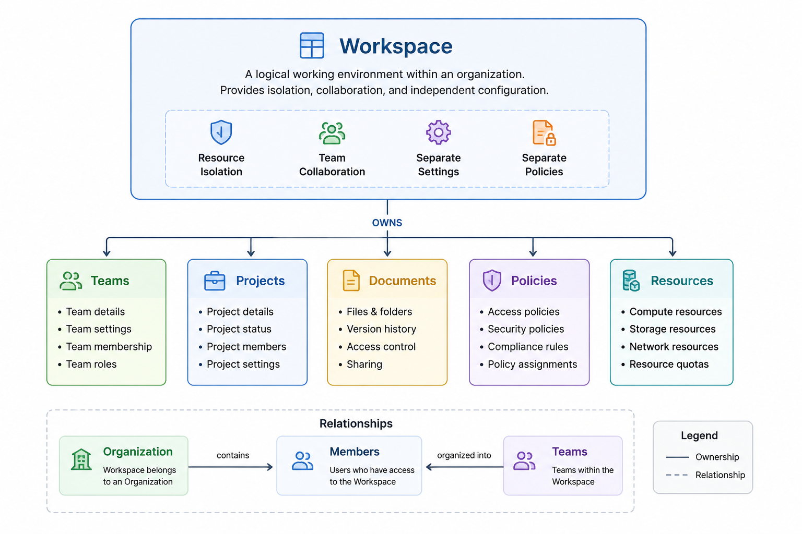

# Workspace Management Service

## Responsibility

A Workspace is a logical working environment within an organization. It provides isolation, collaboration boundaries, and independent configuration for teams and resources.

## Example

A company such as Microsoft may organize its work into multiple workspaces:

```text
Microsoft
├── Engineering Workspace
├── Marketing Workspace
├── Finance Workspace
└── Security Workspace
```

## Workspace Capabilities

A workspace provides:

* Resource isolation
* Team collaboration
* Separate settings
* Separate policies

## Ownership Model

A workspace owns and manages the following entities:

```text
Workspace
├── Teams
├── Projects
├── Documents
├── Policies
└── Resources
```


## API Endpoints

### Workspace Management

```http
POST   /workspaces
GET    /workspaces
GET    /workspaces/{workspace_id}
PATCH  /workspaces/{workspace_id}
DELETE /workspaces/{workspace_id}
```

### Workspace Relationships

```http
GET    /workspaces/{workspace_id}/members
GET    /workspaces/{workspace_id}/teams
```

### Workspace Lifecycle

```http
POST   /workspaces/{workspace_id}/archive
POST   /workspaces/{workspace_id}/restore
```

### Workspace Settings

```http
GET    /workspaces/{workspace_id}/settings
PATCH  /workspaces/{workspace_id}/settings
```
